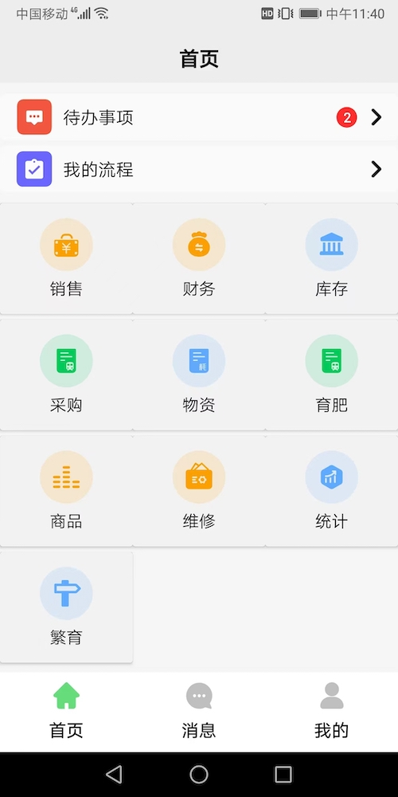
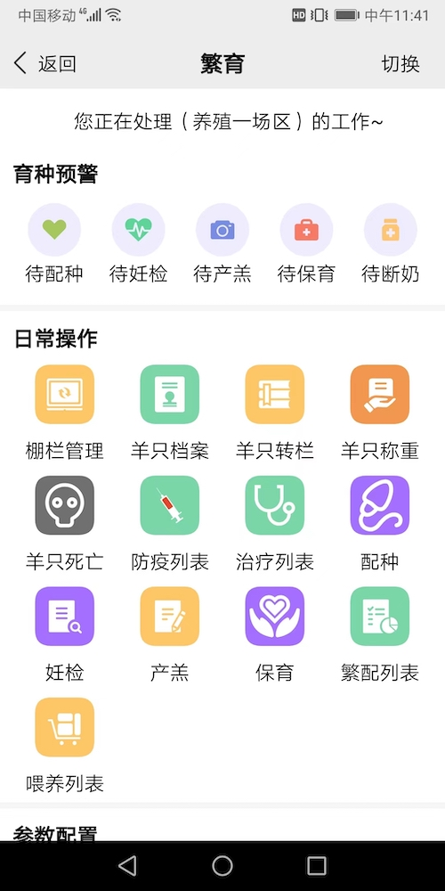
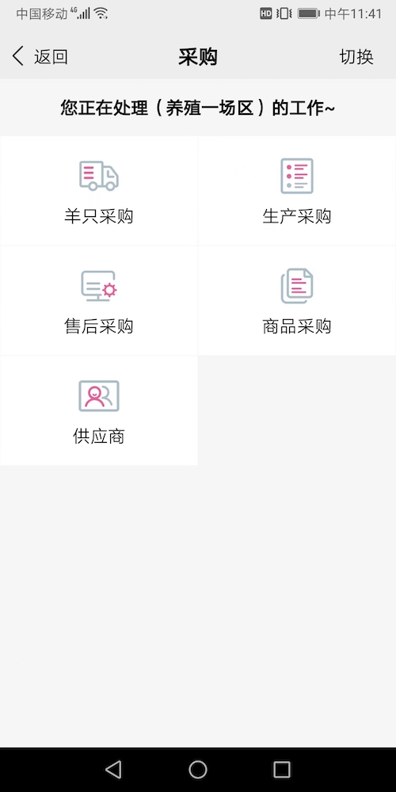
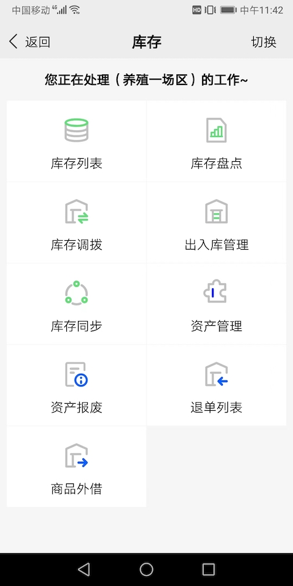
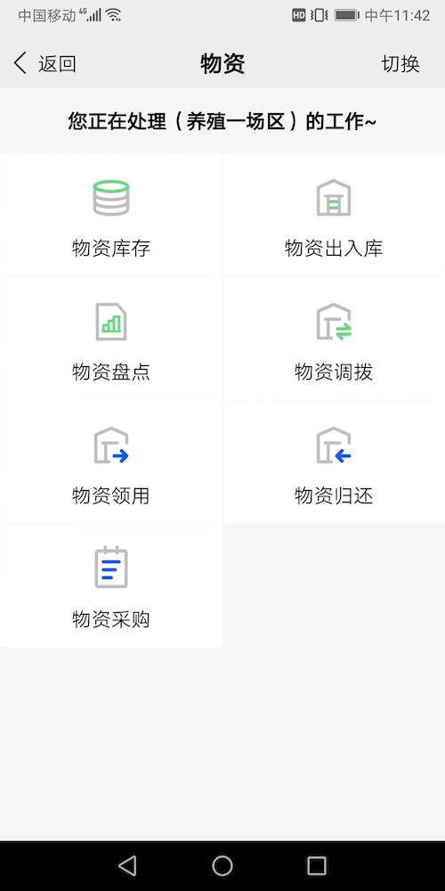

# hongmi9527
##### 畜牧数字化ERP系统、智慧农牧、养殖繁育ERP系统、养殖进销存（WMS） 
##### 数智养殖平台是一款集“养殖”、“销售”、“仓储”、“资产”、“财务”、“服务”、“售后”一体化协作管理平台。
##### 解决人力成本、饲料成本、绩效考核、财务核算，提高生产效率，降低经营成本，增强企业整体竞争力。 
##### 牛、羊养殖繁育、财务、库存、采购、资产、客户、生产、销售管理、流程审批等一体化运营系统，对养殖繁育、养殖育肥进行精细化管理。
# 系统架构

# 公司端APP介绍
|  |  |
|  |  |
|  |  |
|  |  |
|  |  |
