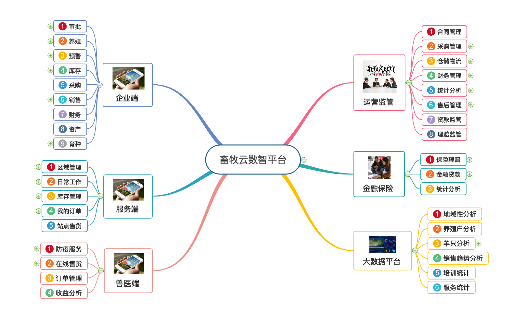

# hongmi9527
农牧行业专业定制 种、养、加、销、运智慧高效一体化解决方案。主要应用在繁育、养殖、社会化服务、屠 宰加工、金融保险、销售、运营、监管等畜牧业全产业链的各重要环节，是为农牧民、 合作社、企业等提供饲养技术、繁育服务、远程诊断、农资流通、金融保险、产品销 售、市场分析、运营监管等服务的服务型大数据云计算平台。
# 系统架构

# 公司端APP介绍
|  |  |
|  |  |
|  |  |
|  |  |
|  |  |
